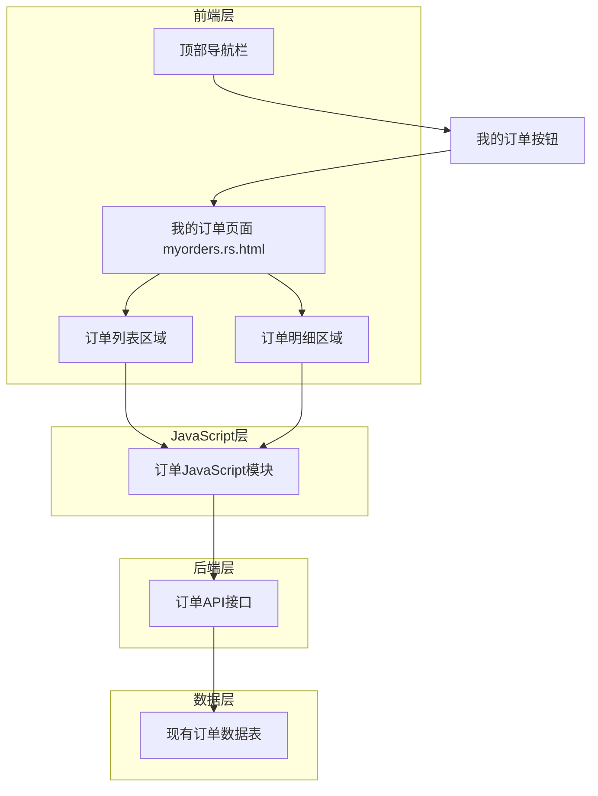
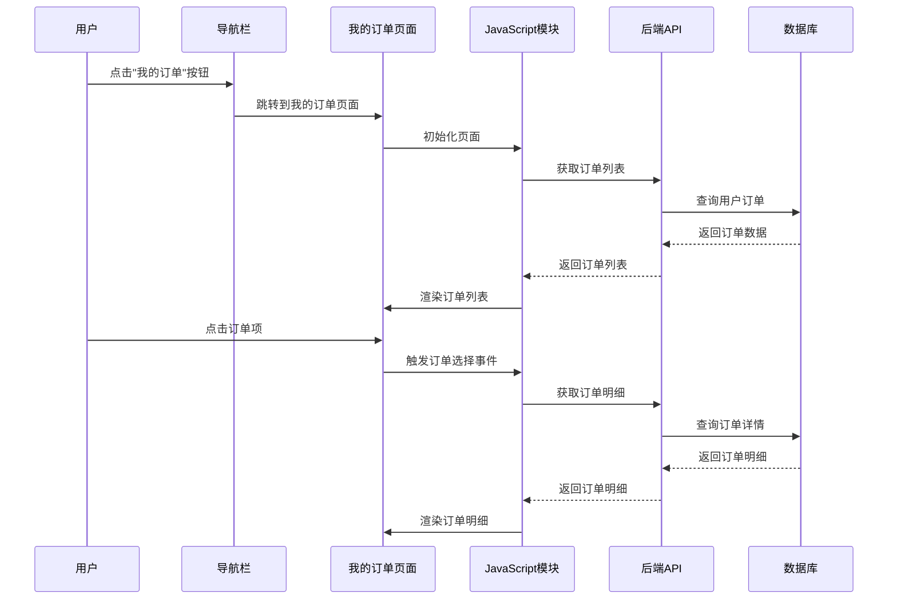

# 我的订单功能设计文档

## 概述

为现有系统添加"我的订单"功能，允许用户查看从购物车提交后生成的订单。该功能将与现有的购物车系统和订单系统集成，提供完整的订单查看体验。设计将使用现有的技术栈（Rust + Actix-web + PostgreSQL + JavaScript）并保持与现有系统的一致性。

## 架构

### 系统架构图



### 数据流图



## 组件和接口

### 1. 前端UI组件

#### 1.1 导航栏组件修改
- **位置**: 顶部导航栏，购物车左侧
- **元素**: 
  - "我的订单"按钮（使用Font Awesome订单图标）
  - 与现有导航按钮保持一致的样式
- **样式**: 继承现有的`#go-home`区域样式

#### 1.2 我的订单页面布局
- **页面结构**: 
  - 页面标题区域
  - 左右分栏布局（类似购物车页面）
  - 左侧：订单列表区域（30%宽度）
  - 右侧：订单明细区域（70%宽度）

#### 1.3 订单列表组件
- **位置**: 页面左侧
- **元素**: 
  - 订单项列表（可滚动）
  - 每个订单项显示：订单号、订单日期、订单状态
  - 选中状态高亮显示
- **样式**: 使用现有的表格和列表样式

#### 1.4 订单明细组件
- **位置**: 页面右侧
- **元素**: 
  - 订单基本信息（订单号、日期、状态）
  - 商品明细表格（物料号、商品名称等，与购物车中明细表基本一致，但去除“加入时间”和“操作”两列）
  - 订单汇总信息（总数量、总重量）
- **样式**: 继承购物车明细表格样式，但移除操作列

### 2. JavaScript模块

#### 2.1 订单管理器 (OrderManager)
```javascript
class OrderManager {
    constructor() {
        this.orders = [];
        this.selectedOrder = null;
        this.isLoading = false;
    }
    
    // 初始化订单管理器
    async init()
    
    // 获取用户订单列表
    async getOrdersList()
    
    // 获取订单明细
    async getOrderDetails(orderId)
    
    // 选择订单
    selectOrder(orderId)
    
    // 渲染订单列表
    renderOrdersList()
    
    // 渲染订单明细
    renderOrderDetails(orderData)
    
    // 更新订单状态显示
    updateOrderStatus(status)
}
```

#### 2.2 页面控制器 (MyOrdersPageController)
```javascript
class MyOrdersPageController {
    constructor() {
        this.orderManager = new OrderManager();
    }
    
    // 初始化页面
    async initPage()
    
    // 绑定事件监听器
    bindEventListeners()
    
    // 处理订单项点击
    handleOrderItemClick(orderId)
    
    // 处理页面刷新
    handlePageRefresh()
    
    // 显示加载状态
    showLoadingState()
    
    // 隐藏加载状态
    hideLoadingState()
}
```

### 3. 后端API接口

#### 3.1 获取用户订单列表
- **路径**: `POST /stock/get_user_orders`
- **请求体**:
```json
{
    "user_id": 123
}
```
- **响应**:
```json
{
    "success": true,
    "orders": [
        {
            "order_id": "ORD-20241024123456-123",
            "created_at": "2024-10-24T12:34:56Z",
            "status": "pending",
        }
    ],
    "total_count": 10
}
```

#### 3.2 获取订单明细
- **路径**: `POST /stock/get_order_details`
- **请求体**:
```json
{
    "user_id": 123,
    "order_id": "ORD-20241024123456-123"
}
```
- **响应**:
```json
{
    "success": true,
    "order": {
        "order_id": "ORD-20241024123456-123",
        "created_at": "2024-10-24T12:34:56Z",
        "status": "pending",
        "items": [
            {
                "material_number": "MAT001",
                "product_name": "钢管",
                "specification": "φ108×4",
                "status": "现货",
                "standard": "GB/T8162",
                "manufacturer": "宝钢",
                "heat_number": "H123456",
                "stock_length": 6000,
                "stock_weight": 125.5,
            }
        ],
        "summary": {
            "total_items": 5,
            "total_weight": 1250.50
        }
    }
}
```

### 4. Rust后端实现

#### 4.1 订单模块结构
```rust
// src/orders.rs
use actix_identity::Identity;
use actix_web::{post, web, HttpResponse};
use deadpool_postgres::Pool;
use serde::{Deserialize, Serialize};

#[derive(Deserialize)]
pub struct UserOrdersRequest {
    user_id: i32,
}

#[derive(Deserialize)]
pub struct OrderDetailsRequest {
    user_id: i32,
    order_id: String,
}

#[derive(Serialize)]
pub struct OrderSummary {
    order_id: String,
    created_at: String,
    status: String,
    item_count: i32,
    total_amount: f64,
}

#[derive(Serialize)]
pub struct UserOrdersResponse {
    success: bool,
    orders: Vec<OrderSummary>,
    total_count: i32,
}

#[derive(Serialize)]
pub struct OrderDetailItem {
    material_number: String,
    product_name: String,
    specification: String,
    status: String,
    standard: String,
    manufacturer: String,
    heat_number: String,
    stock_length: i32,
    stock_weight: f64,
    unit_price: f64,
    quantity: i32,
    total_price: f64,
}

#[derive(Serialize)]
pub struct OrderSummaryInfo {
    total_items: i32,
    total_quantity: i32,
    total_amount: f64,
}

#[derive(Serialize)]
pub struct OrderDetails {
    order_id: String,
    created_at: String,
    status: String,
    items: Vec<OrderDetailItem>,
    summary: OrderSummaryInfo,
}

#[derive(Serialize)]
pub struct OrderDetailsResponse {
    success: bool,
    order: Option<OrderDetails>,
}
```

## 数据模型

### 现有数据表利用

#### 1. orders表（已存在）
```sql
CREATE TABLE orders (
    id SERIAL PRIMARY KEY,
    order_id VARCHAR(50) UNIQUE NOT NULL,
    user_id INTEGER NOT NULL,
    status VARCHAR(20) DEFAULT 'pending',
    created_at TIMESTAMP DEFAULT CURRENT_TIMESTAMP,
    FOREIGN KEY (user_id) REFERENCES customers(id) ON DELETE CASCADE
);

create index user_id_index on orders(user_id);
```

#### 2. order_items表（已存在）
```sql
CREATE TABLE order_items (
    id uuid PRIMARY KEY,
    order_id VARCHAR(50) NOT NULL,
    material_number VARCHAR(50) NOT NULL,
    FOREIGN KEY (order_id) REFERENCES orders(order_id) ON DELETE CASCADE,
    FOREIGN KEY (material_number) REFERENCES products(物料号) ON DELETE CASCADE
);
create index order_id_index on order_items(order_id);
create index material_number_index on order_items(material_number);
```

### 订单状态定义
- `pending`: 待处理
- `done`: 已处理

## 错误处理

### 前端错误处理
1. **网络错误**: 显示网络连接失败提示，提供重试选项
2. **服务器错误**: 显示服务器错误提示
3. **权限错误**: 跳转到登录页面
4. **数据为空**: 显示"暂无订单"的友好提示
5. **订单不存在**: 显示订单不存在或已删除的提示

### 后端错误处理
1. **用户未登录**: 返回401状态码
2. **订单不存在**: 返回404状态码
3. **权限不足**: 返回403状态码（用户尝试访问其他用户的订单）
4. **数据库错误**: 返回500状态码并记录日志
5. **参数验证失败**: 返回400状态码

## 测试策略

### 单元测试
1. **JavaScript模块测试**:
   - OrderManager类的各个方法
   - 页面控制器的事件处理
   - API调用的错误处理

2. **Rust后端测试**:
   - API接口的正常流程
   - 错误情况的处理
   - 数据库查询的正确性
   - 用户权限验证

### 集成测试
1. **前后端集成**:
   - 订单列表加载的完整流程
   - 订单明细显示的完整流程
   - 用户权限验证的集成

2. **用户界面测试**:
   - 页面布局的响应式设计
   - 订单列表的滚动和选择
   - 订单明细的正确显示

### 性能测试
1. **响应时间测试**: 确保订单列表在3秒内加载完成
2. **并发测试**: 测试多用户同时访问的性能
3. **数据库性能**: 测试大量订单数据的查询性能

## 实现细节

### 1. 导航栏集成
- 修改`templates/base.rs.html`，在购物车左侧添加"我的订单"按钮
- 使用Font Awesome的`fa-list-alt`图标
- 保持与现有导航按钮一致的样式和行为

### 2. 页面路由
- 在`src/html.rs`中添加新的路由处理函数
- 创建`templates/myorders.rs.html`模板文件
- 在`src/main.rs`中注册新的路由

### 3. 样式集成
- 使用现有的SCSS变量和混合器
- 订单列表使用类似表格的样式
- 订单明细继承购物车明细的样式
- 添加订单状态的颜色标识

### 4. JavaScript集成
- 创建`assets/js/pages/myorders.js`文件
- 使用现有的`service.js`中的工具函数
- 遵循现有的代码风格和命名约定
- 使用现有的`notifier`组件显示提示信息

### 5. 后端集成
- 创建新的`src/orders.rs`模块
- 在`src/main.rs`中注册订单相关路由
- 使用现有的数据库连接池
- 集成现有的用户认证机制

### 6. 数据库查询优化
- 利用现有的索引结构
- 使用JOIN查询获取完整的商品信息
- 实现分页查询以处理大量订单数据

## 安全考虑

### 1. 用户认证
- 所有订单查看操作都需要用户登录
- 使用现有的session机制验证用户身份
- 防止用户查看其他用户的订单数据

### 2. 数据验证
- 验证订单ID的有效性
- 验证用户权限，确保只能查看自己的订单
- 防止SQL注入和XSS攻击

### 3. 权限控制
- 用户只能查看自己的订单
- 管理员可以查看所有用户的订单（预留功能）
- 实现基于角色的访问控制

## 部署考虑

### 1. 数据库兼容性
- 利用现有的orders和order_items表
- 确保与现有数据的兼容性
- 不需要额外的数据库迁移

### 2. 静态资源
- 新增的CSS和JavaScript文件需要编译和压缩
- 更新现有的构建脚本
- 确保资源文件的正确引用

### 3. 缓存策略
- 订单数据可以使用适当的缓存策略
- 静态资源的缓存配置
- 考虑订单状态更新的缓存失效

## 扩展性考虑

### 1. 功能扩展
- 订单搜索和筛选功能
- 订单状态跟踪功能
- 订单导出功能
- 订单重新下单功能

### 2. 性能优化
- 订单数据的分页加载
- 数据库查询的进一步优化
- 前端虚拟滚动（处理大量订单）

### 3. 多语言支持
- 继承现有的中英文切换功能
- 订单相关文本的国际化
- 订单状态的多语言显示

## 用户体验设计

### 1. 响应式设计
- 适配不同屏幕尺寸
- 移动端友好的订单查看体验
- 触摸友好的交互设计

### 2. 加载状态
- 订单列表加载时的骨架屏
- 订单明细加载的进度指示
- 网络错误时的重试机制

### 3. 交互反馈
- 订单项选择的视觉反馈
- 订单状态的颜色编码
- 空状态的友好提示

### 4. 可访问性
- 键盘导航支持
- 屏幕阅读器友好
- 高对比度模式支持