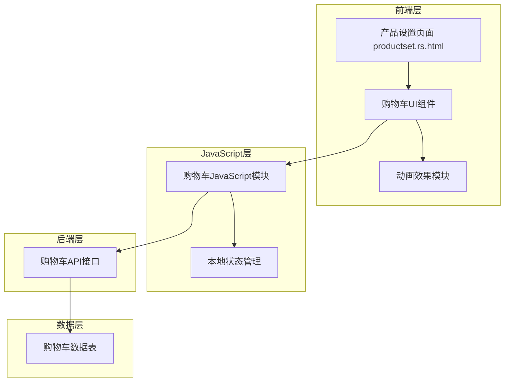

# 购物车功能设计文档

## 概述

为现有的产品设置页面（productset.rs.html）添加购物车功能，包括前端用户界面、交互动画、后端API接口和数据存储。设计将与现有的系统架构和样式保持一致，使用现有的技术栈（Rust + Actix-web + PostgreSQL + JavaScript）。

## 架构

### 系统架构图



## 组件和接口

### 1. 前端UI组件

#### 1.1 购物车图标组件
- **位置**: 页面顶部右侧区域
- **元素**: 
  - 购物车图标（使用Font Awesome图标）
  - 数量角标（显示商品数量）
- **样式**: 与现有header样式保持一致

#### 1.2 添加按钮组件
- **位置**: 每个产品条目前
- **元素**: 
  - 加号按钮（+ 图标）
  - 加载状态指示器
- **样式**: 与现有按钮样式保持一致

#### 1.3 动画组件
- **类型**: CSS3 + JavaScript动画
- **效果**: 
  - 产品从按钮位置飞向购物车图标
  - 购物车数量角标的数字增加动画
  - 按钮点击反馈动画

### 2. JavaScript模块

#### 2.1 购物车管理器 (CartManager)
```javascript
class CartManager {
    constructor() {
        this.cartCount = 0;
        this.isLoading = false;
    }
    
    // 初始化购物车
    async init()
    
    // 添加商品到购物车
    async addToCart(materialNumber)
    
    // 更新购物车数量显示
    updateCartDisplay(count)
    
    // 播放添加动画
    playAddAnimation(buttonElement)
    
    // 获取购物车数量
    async getCartCount()
}
```

#### 2.2 动画控制器 (AnimationController)
```javascript
class AnimationController {
    // 播放飞行动画
    playFlyAnimation(fromElement, toElement)
    
    // 播放数量增加动画
    playCountAnimation(element)
    
    // 播放按钮反馈动画
    playButtonFeedback(buttonElement)
}
```

### 3. 后端API接口

#### 3.1 添加商品到购物车
- **路径**: `POST /stock/cart/add`
- **请求体**:
```json
{
    "material_number": "string",
    "quantity": 1
}
```
- **响应**:
```json
{
    "success": true,
    "cart_count": 5,
    "message": "商品已添加到购物车"
}
```

#### 3.2 获取购物车数量
- **路径**: `GET /stock/cart/count`
- **响应**:
```json
{
    "count": 5
}
```

#### 3.3 获取购物车商品列表（预留）
- **路径**: `GET /stock/cart/items`
- **响应**:
```json
{
    "items": [
        {
            "material_number": "string",
            "quantity": 1,
            "added_at": "2023-10-23T10:00:00Z"
        }
    ],
    "total_count": 5
}
```

### 4. Rust后端实现

#### 4.1 购物车模块结构
```rust
// src/cart.rs
use actix_identity::Identity;
use actix_web::{get, post, web, HttpResponse};
use deadpool_postgres::Pool;
use serde::{Deserialize, Serialize};

#[derive(Deserialize)]
pub struct AddToCartRequest {
    material_number: String,
    quantity: i32,
}

#[derive(Serialize)]
pub struct CartResponse {
    success: bool,
    cart_count: i32,
    message: String,
}

#[derive(Serialize)]
pub struct CartCountResponse {
    count: i32,
}
```

## 数据模型

### 购物车数据表设计

```sql
CREATE TABLE shopping_cart (
    id SERIAL PRIMARY KEY,
    user_id INTEGER NOT NULL,
    material_number TEXT NOT NULL,
    quantity INTEGER NOT NULL DEFAULT 1,
    added_at TIMESTAMP DEFAULT CURRENT_TIMESTAMP,
    updated_at TIMESTAMP DEFAULT CURRENT_TIMESTAMP,
    
    CONSTRAINT fk_cart_user FOREIGN KEY (user_id) REFERENCES customers(id) ON DELETE CASCADE,
    CONSTRAINT fk_cart_material FOREIGN KEY (material_number) REFERENCES products(物料号) ON DELETE CASCADE,
    CONSTRAINT unique_user_material UNIQUE (user_id, material_number)
);

-- 创建索引以提高查询性能
CREATE INDEX idx_shopping_cart_user_id ON shopping_cart(user_id);
CREATE INDEX idx_shopping_cart_material ON shopping_cart(material_number);
```

### 数据表字段说明
- `id`: 主键，自增
- `user_id`: 用户ID，关联用户表
- `material_number`: 物料号，关联产品表
- `quantity`: 数量，支持同一商品多次添加
- `added_at`: 首次添加时间
- `updated_at`: 最后更新时间

## 错误处理

### 前端错误处理
1. **网络错误**: 显示网络连接失败提示
2. **服务器错误**: 显示服务器错误提示
3. **权限错误**: 跳转到登录页面
4. **重复添加**: 显示商品已在购物车中的提示

### 后端错误处理
1. **用户未登录**: 返回401状态码
2. **商品不存在**: 返回404状态码
3. **数据库错误**: 返回500状态码并记录日志
4. **参数验证失败**: 返回400状态码

## 测试策略

### 单元测试
1. **JavaScript模块测试**:
   - CartManager类的各个方法
   - AnimationController的动画效果
   - API调用的错误处理

2. **Rust后端测试**:
   - API接口的正常流程
   - 错误情况的处理
   - 数据库操作的正确性

### 集成测试
1. **前后端集成**:
   - 添加商品的完整流程
   - 购物车数量的实时更新
   - 用户会话的处理

2. **用户界面测试**:
   - 按钮点击响应
   - 动画效果的流畅性
   - 不同屏幕尺寸的适配

### 性能测试
1. **响应时间测试**: 确保添加操作在500ms内完成
2. **并发测试**: 测试多用户同时操作的性能
3. **数据库性能**: 测试大量购物车数据的查询性能

## 实现细节

### 1. 样式集成
- 使用现有的SCSS变量和混合器
- 购物车图标使用Font Awesome图标库
- 按钮样式继承现有的`.btn`类
- 动画使用CSS3 transition和transform

### 2. JavaScript集成
- 集成到现有的`productset.js`文件中
- 使用现有的`service.js`中的工具函数
- 遵循现有的代码风格和命名约定
- 使用现有的`notifier`组件显示提示信息

### 3. 后端集成
- 添加新的`cart.rs`模块
- 在`main.rs`中注册购物车路由
- 使用现有的数据库连接池
- 集成现有的用户认证机制

### 4. 数据库集成
- 在现有的PostgreSQL数据库中创建购物车表
- 使用现有的用户表进行关联
- 添加必要的索引以优化查询性能

## 安全考虑

### 1. 用户认证
- 所有购物车操作都需要用户登录
- 使用现有的session机制验证用户身份
- 防止用户操作其他用户的购物车数据

### 2. 数据验证
- 验证物料号的有效性
- 限制购物车商品数量的合理范围
- 防止SQL注入和XSS攻击

### 3. 权限控制
- 用户只能操作自己的购物车
- 管理员可以查看所有用户的购物车（可选功能）

## 部署考虑

### 1. 数据库迁移
- 提供SQL脚本创建购物车表
- 考虑现有数据的兼容性
- 提供回滚方案

### 2. 静态资源
- 新增的CSS和JavaScript文件需要编译和压缩
- 更新现有的构建脚本

### 3. 缓存策略
- 购物车数量可以使用Redis缓存（可选）
- 静态资源的缓存策略

## 扩展性考虑

### 1. 功能扩展
- 购物车商品的删除和修改
- 购物车页面的完整实现
- 批量操作功能

### 2. 性能优化
- 购物车数据的缓存机制
- 数据库查询的优化
- 前端状态管理的优化

### 3. 多语言支持
- 继承现有的中英文切换功能
- 购物车相关文本的国际化