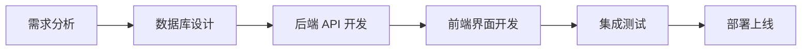

# wx-stock 开发者指南

这是一个专为 AI 助手和开发者设计的技术文档，包含项目的深度技术信息、开发模式、最佳实践和故障排除指南。

## 项目架构深度分析

### 技术选型理念

**Rust + Actix-web 的选择原因：**
- **性能**: Rust 的零成本抽象和内存安全保证高性能
- **并发**: Actix-web 基于 Actor 模型，天然支持高并发
- **安全**: 编译时检查，避免内存泄漏和并发竞争
- **生态**: 丰富的 crates 生态系统

**单体架构的考虑：**
- 简化部署和运维
- 减少网络延迟
- 适合中小型企业应用场景
- 便于版本管理和发布

### 核心设计模式

#### 1. 编译时模板系统
```rust
// build.rs 中的模板编译
use ructe::{Result, Ructe};

fn main() -> Result<()> {
    let mut ructe = Ructe::from_env()?;
    ructe.statics()?.add_files("static")?;
    ructe.compile_templates("templates")?;
    Ok(())
}
```

**优势：**
- 编译时错误检查
- 零运行时模板解析开销
- 静态文件嵌入，减少 I/O

#### 2. 异步数据库连接池
```rust
// 配置连接池
let pool = config
    .pg
    .create_pool(Some(Runtime::Tokio1), tokio_postgres::NoTls)
    .unwrap();

// 使用连接
let conn = db.get().await.unwrap();
```

**特点：**
- 自动连接管理
- 异步非阻塞操作
- 连接复用，提高性能

#### 3. 前端组件化设计
```javascript
// 组件模块化
var service = function () {
    // 私有函数
    let build_table_header = function() { /* ... */ };
    
    // 公共接口
    return {
        build_table_header: build_table_header,
        build_product_table: build_product_table,
        // ...
    }
}();
```

## 关键代码模块解析

### 1. 身份验证系统

**Cookie 认证配置：**
```rust
.wrap(IdentityService::new(
    CookieIdentityPolicy::new(&[6; 32])
        .name("auth-guest")
        .max_age(Duration::days(30))
        .secure(false),
))
```

**用户验证流程：**
1. 用户登录 → 设置 Cookie
2. 请求拦截 → 验证 Cookie
3. 获取用户信息 → 返回页面或重定向登录

### 2. 数据库抽象层

**查询模式：**
```rust
// 参数化查询防止 SQL 注入
let rows = &conn.query(
    "SELECT * FROM products WHERE name LIKE $1 LIMIT $2",
    &[&search_pattern, &limit],
).await.unwrap();
```

**错误处理：**
- 使用 `Result<T, E>` 类型处理错误
- 数据库连接失败时的优雅降级
- 事务管理和回滚机制

### 3. 前端数据绑定

**表格数据流：**
```javascript
// 数据获取 → 渲染 → 用户交互 → 更新
fetch_table() → render_rows() → user_click() → update_sort()
```

**增量编译系统：**
```javascript
// 文件时间戳比较
function needs_rebuild(target, sources) {
    if (!fs.existsSync(target)) return true;
    
    for (let source of sources) {
        if (fs.statSync(source).mtime > fs.statSync(target).mtime) {
            return true;
        }
    }
    return false;
}
```

## 开发工作流程

### 1. 功能开发流程



### 2. 代码修改流程

**前端修改：**
```bash
# 1. 修改 JavaScript/SCSS 文件
vim assets/js/parts/service.js

# 2. 增量构建
./scripts/build.sh

# 3. 测试验证
curl http://localhost:8087/stock/

# 4. 提交代码
git add . && git commit -m "fix: 修复表格排序问题"
```

**后端修改：**
```bash
# 1. 修改 Rust 源码
vim src/product.rs

# 2. 编译测试
cargo check && cargo test

# 3. 运行服务
./run.sh

# 4. 发布构建
cargo build --release
```

### 3. 部署工作流

**本地开发 → 测试环境 → 生产环境**

```bash
# 开发测试
./run.sh

# 发布构建
cargo build --release
./scripts/build.sh --force （可选）

# 上传部署
sh put.sh  # 上传到 FreeBSD 服务器
```

## 性能优化指南

### 1. 数据库优化

**索引策略：**
```sql
-- 常用查询字段添加索引
CREATE INDEX idx_products_material ON products(物料号);
CREATE INDEX idx_tree_pnum ON tree(pnum);
CREATE INDEX idx_documents_date ON documents(日期);
```

**查询优化：**
```sql
-- 使用 LIMIT 限制返回结果
SELECT * FROM products WHERE name LIKE '%钢管%' LIMIT 50;

-- 使用 EXISTS 代替 IN 子查询
SELECT * FROM products p 
WHERE EXISTS (SELECT 1 FROM tree t WHERE t.num = p.分类编号);
```

## 代码规范和最佳实践

### 1. Rust 代码规范

**命名约定：**
```rust
// 函数名使用 snake_case
fn fetch_product_list() -> Vec<Product> { }

// 结构体使用 PascalCase
struct ProductData {
    material_code: String,
}

// 常量使用 SCREAMING_SNAKE_CASE
const MAX_ITEMS_PER_PAGE: i32 = 50;
```

**错误处理：**
```rust
// 使用 Result 类型处理可能失败的操作
fn parse_user_input(input: &str) -> Result<i32, ParseIntError> {
    input.parse::<i32>()
}

// 使用 ? 操作符简化错误传播
fn process_data() -> Result<String, Box<dyn Error>> {
    let data = fetch_data()?;
    let processed = transform_data(data)?;
    Ok(processed)
}
```

### 2. JavaScript 代码规范

**模块化：**
```javascript
// 使用 IIFE 创建模块
var MyModule = function() {
    // 私有变量和函数
    let privateVar = 'hidden';
    
    function privateFunction() { }
    
    // 公共接口
    return {
        publicMethod: function() { }
    };
}();
```

**异步处理：**
```javascript
// 使用 fetch API 进行异步请求
async function fetchData(url) {
    try {
        const response = await fetch(url);
        if (!response.ok) {
            throw new Error(`HTTP error! status: ${response.status}`);
        }
        return await response.json();
    } catch (error) {
        console.error('Fetch error:', error);
        throw error;
    }
}
```

### 3. SQL 代码规范

**查询优化：**
```sql
-- 使用明确的列名而不是 SELECT *
SELECT p.物料号, p.名称, p.规格型号 
FROM products p 
WHERE p.状态 = '正常';

-- 使用 JOIN 而不是子查询（当适用时）
SELECT p.名称, t.node_name 
FROM products p 
JOIN tree t ON p.分类编号 = t.num;
```

## 扩展和集成指南

### 1. 添加新的 API 端点

```rust
// 1. 在相应模块中定义处理函数
#[post("/new_endpoint")]
pub async fn new_endpoint(
    db: web::Data<Pool>, 
    data: web::Json<RequestData>
) -> HttpResponse {
    // 处理逻辑
    HttpResponse::Ok().json(response_data)
}

// 2. 在 main.rs 中注册路由
.service(module_name::new_endpoint)
```

### 2. 添加新的前端组件

```javascript
// 1. 在 assets/js/parts/ 中创建组件文件
var NewComponent = function() {
    function init() { }
    function render() { }
    
    return { init, render };
}();

// 2. 在构建脚本中包含新文件
// scripts/build.sh 会自动包含 parts 目录下的文件
```

### 3. 数据库迁移

```sql
-- 1. 备份现有数据
pg_dump sales > backup_$(date +%Y%m%d).sql

-- 2. 添加新表或字段
ALTER TABLE products ADD COLUMN new_field VARCHAR(100);

-- 3. 更新相关查询和代码
-- 4. 测试验证
```